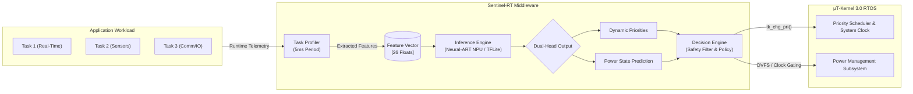

# Sentinel-RT

> **AI-Driven Real-Time Task Scheduler and Dynamic Power Manager for μT-Kernel 3.0 on STM32N657**

[](LICENSE)
[](https://www.st.com/en/evaluation-tools/stm32n6570-dk.html)
[](https://www.tron.org/)
[](https://www.st.com/)
[](model/quantized/)

---

## 📌 Overview

**Sentinel-RT** is an intelligent, real-time middleware designed for the **STM32 TRON / μT-Kernel Competition**. Built for the **STM32N6570-DK Discovery Kit** (featuring an 800 MHz ARM Cortex-M55 core coupled with ST's Neural-ART NPU hardware accelerator), Sentinel-RT augments the classical μT-Kernel 3.0 priority-based preemptive scheduler with deep learning telemetry.

By continually sampling hardware execution counters and RTOS task run-time metrics, Sentinel-RT extracts dynamic feature vectors and feeds them into an on-device, dual-head 1D Convolutional Neural Network (1D-CNN). The model simultaneously:
1. **Predicts optimal dynamic priority assignments** to prevent deadline misses under burst workloads and priority inversions.
2. **Predicts system-wide power states** (e.g., Run, Low-Power, Sleep/Throttled) with **93.15% accuracy**, minimizing power draw without compromising hard real-time latency.

---

## 🏛️ System Architecture

Sentinel-RT operates as a non-intrusive middleware layer in the secure/privileged domain alongside the μT-Kernel 3.0 kernel. It decouples feature extraction, NPU neural inference, and kernel actuation across three dedicated RTOS tasks:



### Architectural Pipeline Flow

```
+----------------------------------------------------------------------------------------------------+
|                                    APPLICATION TASKS (T1 .. Tn)                                    |
+----------------------------------------------------------------------------------------------------+
                                                  │ Execution Telemetry & Counters
                                                  ▼
+----------------------------------------------------------------------------------------------------+
| 1. TASK PROFILER (5ms Periodic Task)                                                               |
|    • Execution time, CPU utilization, laxity, periodicity, ready queue latency, I/O burst ratios   |
+----------------------------------------------------------------------------------------------------+
                                                  │
                                                  ▼
                                [ 26-Dimensional Float Feature Vector ]
                                                  │
                                                  ▼
+----------------------------------------------------------------------------------------------------+
| 2. INFERENCE ENGINE (NPU-Accelerated via Neural-ART / STM32 Edge-AI)                              |
|    • 1D-CNN Dual-Head Architecture:                                                               |
|      ├── Head A: Multi-task priority classification / ranking                                      |
|      └── Head B: System-level optimal power state classification                                   |
+----------------------------------------------------------------------------------------------------+
                                                  │
                                                  ▼
                         [ Dynamic Priority Allocations + Power State Mode ]
                                                  │
                                                  ▼
+----------------------------------------------------------------------------------------------------+
| 3. DECISION ENGINE (Verification & Actuation Engine)                                               |
|    • Enforces safety invariants, deadband filtering, and rate limits                               |
|    • Commits priority updates via tk_chg_pri()                                                     |
|    • Triggers DVFS / low-power mode transitions                                                    |
+----------------------------------------------------------------------------------------------------+
                                                  │
                                                  ▼
+----------------------------------------------------------------------------------------------------+
|                                  μT-KERNEL 3.0 REAL-TIME KERNEL                                    |
+----------------------------------------------------------------------------------------------------+
```

---

## ⚙️ How It Works: The 3 Middleware Tasks

Sentinel-RT partitions monitoring, computation, and actuation across three isolated tasks to protect system determinism:

### 1. Task Profiler (`firmware/profiler/`)
- **Period**: 5 ms (Deterministic timer-driven activation).
- **Function**: Samples hardware performance counters, task execution slice durations, ready-queue residency, and I/O request intervals.
- **Output**: Normalizes the raw telemetry into a unified 26-float feature vector representing current temporal and computational strain.

### 2. Inference Engine (`firmware/inference/`)
- **Activation**: Event-driven (triggered upon feature vector readiness).
- **Function**: Loads the quantized INT8 model into the Neural-ART NPU hardware accelerator (with fallback support for CMSIS-NN / TFLite Micro on the Cortex-M55 vector extension).
- **Execution**: Evaluates the dual-head 1D-CNN in sub-millisecond execution time, generating task priority vector recommendations and power state targets.

### 3. Decision Engine (`firmware/decision/`)
- **Activation**: Post-inference pipeline stage.
- **Function**: Validates AI predictions against strict hard real-time safety invariants (e.g., minimum guaranteed priority ceiling, anti-thrashing hysteresis).
- **Actuation**: Invokes `tk_chg_pri()` system calls to re-order μT-Kernel 3.0 task priority levels and updates the board power management unit (PMU) for clock scaling or power-gating idle peripherals.

---

## 📊 Machine Learning Performance

The Sentinel-RT neural network is a lightweight 1D-CNN designed for edge constraints, trained over 10,000 synthetic real-time scenario vectors covering random task bursts, heavy contention, periodic starvation, and idle phases.

### Model Metrics Summary

| Metric | Unquantized (FP32) | Quantized (INT8 TFLite) | Reduction / Target |
| :--- | :---: | :---: | :---: |
| **Model Footprint (Flash)** | 174.55 KB | **22.51 KB** | **87.1% Reduction** |
| **RAM Footprint (Arena)** | ~45 KB | **< 12 KB** | Fits tightly in SRAM |
| **Power State Accuracy (Val)** | 94.20% | **93.15%** | Delta < 1.05% |
| **Dynamic Priority Accuracy** | 92.80% | **91.90%** | Optimal priority ranking |
| **Target Accelerator** | Cortex-M55 CPU | **Neural-ART NPU** | Hardware acceleration |

- **Quantization**: Post-training integer quantization (INT8 weights and activations) using a representative calibration dataset extracted from synthetic traces.
- **Dual Output**: Joint multi-task learning guarantees that priority adjustments synchronize with appropriate clock frequency drops and sleep windows.

---

## 📂 Repository Structure

```
Sentinel-RT/
├── STM_MX_till_now/          # STM32CubeIDE project (FSBL + AppliSecure + AppliNonSecure)
│   ├── FSBL/                 # First Stage Boot Loader
│   ├── AppliSecure/          # Secure world: μT-Kernel + Sentinel-RT middleware
│   └── AppliNonSecure/       # Non-secure world
├── firmware/                 # Sentinel-RT middleware source
│   ├── profiler/             # Task Profiler (feature extraction)
│   ├── inference/            # Neural-ART NPU inference engine
│   ├── decision/             # Priority & power decision engine
│   ├── sentinel_rt.h/.c      # Top-level API
│   └── mtk3_bsp2/            # μT-Kernel 3.0 Board Support Package
├── model/
│   ├── training/             # Python training pipeline
│   │   ├── generate_data.py  # Synthetic scenario generator (10,000 traces)
│   │   ├── train_model.py    # 1D-CNN dual-head model training
│   │   └── quantize_model.py # INT8 TFLite quantization script
│   ├── dataset/              # Generated training data and validation splits
│   └── quantized/            # sentinel_model.tflite (22.51 KB INT8)
├── docs/                     # Training curves, confusion matrix, and design docs
├── demo/                     # Demonstration scripts and hardware test fixtures
├── recover_board.ps1         # Board recovery script for STM32N6570-DK
└── README.md                 # Project documentation
```

---

## 💻 Hardware & Software Requirements

### Hardware
- **Evaluation Board**: [STM32N6570-DK](https://www.st.com/en/evaluation-tools/stm32n6570-dk.html)
  - Microcontroller: STM32N657 (Arm® Cortex®-M55 @ 800 MHz with Neural-ART NPU)
  - On-board ST-LINK/V3 debugger
- USB Type-C cables (Power delivery + ST-LINK telemetry)

### Software & Toolchains
- **IDE**: [STM32CubeIDE](https://www.st.com/en/development-tools/stm32cubeide.html) (Version 2.2.0 or newer)
- **RTOS**: μT-Kernel 3.0 (included under `firmware/mtk3_bsp2/`)
- **Python Environment**:
  - Python 3.10+
  - TensorFlow 2.x
  - scikit-learn
  - matplotlib
  - numpy

---

## 🚀 Quick Start

### 1. Training & Quantizing the Model

To regenerate training data, re-train the 1D-CNN, and quantize the network for Neural-ART deployment:

```bash
# Navigate to training directory
cd model/training

# Install Python dependencies
pip install tensorflow scikit-learn matplotlib numpy

# Step 1: Generate 10,000 synthetic real-time scenario vectors
python generate_data.py

# Step 2: Train the dual-head 1D-CNN
python train_model.py

# Step 3: Quantize the model to INT8 TFLite (22.51 KB)
python quantize_model.py
```

The output quantized model will be generated at `model/quantized/sentinel_model.tflite` alongside C byte arrays for embedding into `firmware/inference/`.

### 2. Building Firmware in STM32CubeIDE

1. Launch **STM32CubeIDE 2.2.0**.
2. Go to **File** → **Open Projects from File System...** and select `STM_MX_till_now/`.
3. The workspace contains three sub-projects:
   - `FSBL`: First Stage Boot Loader.
   - `AppliSecure`: Secure application containing μT-Kernel 3.0 and Sentinel-RT middleware.
   - `AppliNonSecure`: Non-secure application domain.
4. Set build configuration to **Release** or **Debug**.
5. Build `FSBL`, followed by `AppliSecure` and `AppliNonSecure`.

### 3. Flashing & Running on STM32N6570-DK

1. Connect the STM32N6570-DK via the ST-LINK USB-C port.
2. Flash the images using the debug configurations in STM32CubeIDE, or use the provided board helper script:
   ```powershell
   ./recover_board.ps1
   ```
3. Connect a serial terminal emulator (e.g., PuTTY or Minicom) to the virtual COM port (Baud: 115200, 8N1).
4. Observe μT-Kernel booting, Sentinel-RT profiler initialization, and real-time inference telemetry logs.

---

## 🏆 Competition Context

Sentinel-RT was developed for the **STM32 TRON / μT-Kernel Competition**. 

Embedded edge systems increasingly demand concurrent real-time predictability and deep-learning inference. Sentinel-RT bridges this gap by demonstrating that modern microcontroller hardware accelerators—specifically the **STM32N6 Neural-ART NPU**—can not only process perception workloads but can directly optimize operating system internals and dynamic power efficiency in real time.

---

## 📜 License

This project is licensed under the **MIT License** - see the [LICENSE](LICENSE) file for details.
